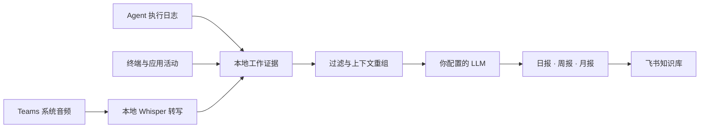

<div align="center">


<br />

### 每个 App 都有日志。现在，你的一天也有了。

把散落在 Agent、终端、应用和会议里的工作重新汇合，<br />
过滤无关噪声，生成日报、周报和月报，自动归档到飞书。

<p>
  
  
  
  
</p>

[为什么需要它](#为什么需要它) · [它如何工作](#它如何工作) · [快速开始](#快速开始) · [隐私边界](#隐私边界) · [Roadmap](#roadmap)

</div>

> [!NOTE]
> Worklog 目前只支持 macOS。签名、公证的 `.dmg` 安装包正在规划中；当前版本从源码安装。

## 为什么需要它

每个 App 都有自己的 log，但你工作了一整天，却没有一份属于自己的工作档案。

过去，我们会在下班前努力回忆：今天做了什么、解决了什么、会议里决定了什么，然后手写一份日报。也许那曾经够用。

但现在是 2026 年。

你可能同时开着三个 Claude Code、一个 OpenCode 和两个 Codex，在无数上下文、Agent 与 Sub-agent 之间穿梭。任务被并行执行，结论散落在不同会话里，很多真正完成的工作甚至没有经过你的键盘。

**问题已经不是「懒得写日报」，而是人很难完整重建这张分布式的工作现场。**

Worklog 为此而生。它从电脑上已经存在的操作与 Agent 执行记录中还原工作过程，把应用活动、终端命令、代码任务和 Teams 会议放回同一天的上下文，再由你选择的 LLM 过滤、理解和总结。

最后留下的不是工具调用流水账，而是一份关于**项目进展、实际产出、关键判断和当前状态**的个人工作档案。

当然，那些与工作无关的事情会被过滤掉。

## 一天，只留一份清楚的记录

<table>
<tr>
<td width="33%" valign="top">

### 01 · 自动采集

持续观察有效工作操作，读取受支持的 Agent 执行日志，并在 Teams 通话时采集系统声音。无需在每个任务结束后手动登记。

</td>
<td width="33%" valign="top">

### 02 · 理解工作

将分散的证据按项目与上下文重组。过滤设备事件、重复操作、静音、识别噪声和与工作无关的内容。

</td>
<td width="33%" valign="top">

### 03 · 自动归档

生成自然、可复盘的日报，并进一步汇总为周报与月报，按「月份 → 周 → 日」写入飞书知识库。

</td>
</tr>
</table>

## 它记录什么

| 记录 | 不记录 |
| --- | --- |
| Claude Code 与 Codex 的任务、工具调用和文件操作 | 键盘输入与密码 |
| 可确认的终端命令和前台应用上下文 | 剪贴板内容 |
| Teams 中电脑实际播放的会议声音 | 麦克风音频 |
| 会议讨论、结论与待办 | 截图与屏幕画面 |
| 生成报告所需的结构化工作证据 | 浏览器页面正文 |
| 日报、周报和月报的本地副本 | 与工作无关的系统事件 |

当前版本会深度解析 **Claude Code** 与 **Codex** 的执行日志。OpenCode 等其他 Agent 工具目前通过前台应用与终端活动提供线索，后续将逐步增加原生日志解析器。

## 它如何工作



<details>
<summary><strong>默认自动运行时间</strong></summary>

- 工作日 18:00：覆盖生成当天 08:00–18:00 的日报；
- 周一 08:00：汇总上一个自然周，生成周报；
- 每月 1 日 08:10：汇总上一个自然月，生成月报。

</details>

## 核心能力

- **不是流水账**：围绕项目、产出、判断和状态组织内容，不罗列应用切换。
- **会议属于工作本身**：会议结论直接进入当日日报，不另外制造孤立的会议文档。
- **只录系统声音**：即使你全程静音，也能记录其他参会人的发言；不会读取麦克风。
- **本地完成转写**：通过 whisper.cpp 转写 Teams 音频，原始音频不离开电脑。
- **使用自己的模型**：支持 OpenAI 与 Anthropic 兼容接口，模型和服务商由你决定。
- **使用自己的飞书身份**：通过官方飞书 CLI 写入知识库，不保存机器人 App Secret。
- **看得见的自动化**：本地管理页面展示配置、会议状态、最近生成结果与失败重试。
- **登录后常驻**：由 macOS LaunchAgent 启动和恢复，只监听 `127.0.0.1`。

## 快速开始

### 环境要求

- macOS 13+
- Node.js 20+
- [飞书 CLI](https://open.feishu.cn/document/no_class/mcp-archive/feishu-cli-installation-guide.md)
- FFmpeg、whisper.cpp 与 GGML Whisper 模型（Teams 会议功能需要）

### 1 · 启动 Worklog

```bash
npm install
npm run build-native
npm start
```

访问 [http://127.0.0.1:4318](http://127.0.0.1:4318)。

### 2 · 登录飞书 CLI

```bash
npm install -g @larksuite/cli
npx -y skills add https://open.feishu.cn --skill -y
lark-cli config init --new
lark-cli auth login --recommend
lark-cli auth status --json --verify
```

### 3 · 完成初始化

在 Worklog 页面：

1. 确认飞书 CLI 已连接到正确用户；
2. 填写 LLM 协议、API 地址、模型和 API Key；
3. 粘贴目标飞书知识库父页面链接；
4. 点击「立即生成今天日报」完成首次验证。

```bash
# 一次检查主要依赖与授权状态
npm run doctor

# 安装登录自启服务
npm run install-service
```

## Teams 会议

Worklog 通过 CoreAudio 判断 Teams 是否存在真实音频活动，并使用 macOS ScreenCaptureKit 采集电脑正在播放的声音。窗口标题只辅助识别入会和会议名称，不依赖固定关键词。

```bash
brew install ffmpeg whisper-cpp
mkdir -p "$HOME/Library/Application Support/Worklog/models"
curl -L -o "$HOME/Library/Application Support/Worklog/models/ggml-small.bin" \
  https://huggingface.co/ggerganov/whisper.cpp/resolve/main/ggml-small.bin
```

首次录制时，macOS 会请求「屏幕与系统音频录制」权限。会议结束后，逐字稿会经过质量过滤，再与当天其他工作证据共同生成日报。转写或总结失败时，可以从管理页面重试；已有逐字稿会直接复用。

## 隐私边界

Worklog 是一个 **local-first** 项目，而不是一个云端监控服务。

- 原始活动、会议音频、逐字稿、报告副本和飞书索引保存在本机 `~/Library/Application Support/Worklog/`；
- LLM API Key 保存在 macOS Keychain；
- 原始会议音频不会发送给 LLM，也不会上传飞书；
- 只有过滤后的工作证据与有效逐字稿会发送给你配置的 LLM；
- 本机数据、配置与密钥均被 Git 忽略。

> [!IMPORTANT]
> 「本地优先」不代表报告生成完全离线。启用远程 LLM 后，生成所需的文本证据会发往你配置的服务商。请根据其数据政策决定是否启用或增加脱敏规则。

## 项目结构

```text
src/
├── sampler.ts        # macOS 前台应用采样
├── agentLogs.ts      # Agent 执行日志解析
├── collector.ts      # 工作证据过滤与聚合
├── teamsMeeting.ts   # Teams 检测、录制、转写与恢复
├── llm.ts            # 日报、周报和月报生成
├── reportRunner.ts   # 报告生成与发布流程
├── larkCli.ts        # 飞书 CLI 认证与调用
├── feishu.ts         # 知识库层级和文档发布
├── render.ts         # 飞书富文档渲染
└── scheduler.ts      # 自动运行计划
native/               # macOS 音频检测与系统音频采集
public/               # 本地管理页面
scripts/              # 自检与后台服务安装
test/                 # 单元测试
```

## 常见问题

<details>
<summary><strong>飞书 CLI 登录状态失效</strong></summary>

```bash
lark-cli auth status --json --verify
lark-cli auth login --recommend
```

</details>

<details>
<summary><strong>关闭终端后服务停止</strong></summary>

```bash
npm run install-service
launchctl print gui/$(id -u)/com.local.mac-worklog-feishu
```

内部服务标识保留旧名称，用于兼容已经安装的版本，不影响产品显示名称。

</details>

<details>
<summary><strong>报告为什么没有记录晚上或周末的操作</strong></summary>

默认工作证据窗口为工作日 08:00–18:00。这个边界用于避免把私人使用和下班后的系统活动混入工作档案。

</details>

## Roadmap

Worklog 的目标不只是生成一份日报，而是成为 AI 时代个人可拥有、可迁移、可长期检索的工作档案。下面是当前规划方向；顺序代表大致优先级，不代表固定发布日期。

### 近期 · 做成真正的 macOS 产品

- [ ] 发布同时支持 Apple Silicon 与 Intel 的签名、公证 `.dmg`
- [ ] 提供菜单栏应用：查看采集状态、暂停记录、手动生成和快速打开当天文档
- [ ] 将飞书授权、LLM 配置、系统权限、Whisper 模型下载整合进首次启动向导
- [x] 将运行数据迁移到标准的 `Application Support/Worklog`，不再依赖源码目录
- [ ] 支持应用内自动更新、版本说明和安全回滚
- [ ] 在 Mac 睡眠、关机或离线错过任务后自动补跑，并保证同一报告不会重复创建
- [ ] 提供更清楚的健康检查、失败通知、重试队列与可导出的诊断报告

### 更多 Agent 与工作数据源

- [x] Claude Code 原生执行日志
- [x] Codex 原生执行日志
- [x] 终端命令、前台应用和窗口上下文
- [x] Microsoft Teams 系统音频与本地会议转写
- [ ] OpenCode 原生执行日志
- [ ] Cursor、Windsurf、Cline、Continue 等 IDE Agent
- [ ] VS Code、JetBrains 与 Xcode 的项目、文件和调试活动
- [ ] Git 提交、分支、Pull Request、Issue 与 CI 结果
- [ ] 日历日程、任务系统和工单上下文，用于解释「为什么做这件事」
- [ ] Zoom、Google Meet 与飞书会议，并支持说话人区分和待办归属
- [ ] 插件化采集器 SDK，让社区为新 Agent 和工具添加解析器

### 不止飞书：更多归档目的地

- [x] 飞书知识库，按「月份 → 周 → 日」自动归档
- [ ] 本地 Markdown 文件夹，适配 Obsidian、Logseq 和普通 Git 仓库
- [ ] Notion 页面与数据库
- [ ] Google Docs / Google Drive
- [ ] Microsoft 365：OneNote、SharePoint 与 Word
- [ ] 纯本地 HTML / PDF 周报与月报
- [ ] Webhook 与开放 API，接入企业内部知识库或自建系统
- [ ] 同时发布到多个目的地，并分别配置模板、语言和可见内容

### 更懂工作的报告

- [ ] 自动识别项目边界，把同一项目在多个 Agent 和应用中的活动合并
- [ ] 跨会话、跨 Agent 去重，避免把同一修改重复计算为多项成果
- [ ] 区分探索过程、最终决策、已完成产出、阻塞问题与风险
- [ ] 从会议结论追踪后续执行，检查待办是否在之后的工作记录中落地
- [ ] 支持日报、周报、月报、项目周报、绩效回顾等自定义模板
- [ ] 为每条重要结论保留可回溯的本地证据，但默认不在正式报告中堆砌证据编号
- [ ] 建立长期项目记忆，让周报和月报理解连续进展，而不是简单拼接日报
- [ ] 支持中文、英文及双语报告，并允许配置个人写作语气
- [ ] 在发送前提供预览、局部重写、人工确认和版本对比

### 隐私、控制与本地 AI

- [ ] 可配置的敏感信息识别与脱敏：密钥、客户名、仓库名、路径和自定义词表
- [ ] 应用、项目、时间段与会议级别的允许/排除规则
- [ ] 原始记录自动清理策略，以及「只保留摘要、不保留原文」模式
- [ ] 本地数据库加密和可选的报告端到端加密备份
- [ ] 支持 Ollama、MLX、llama.cpp 等完全本地的 LLM
- [ ] 在本地完成嵌入与检索，远程模型只接收最少必要上下文
- [ ] 提供「今天记录了什么」审计视图和一键删除能力

### 跨平台与开放生态

- [ ] Linux 桌面版，优先支持常见终端、编辑器和 Agent 日志
- [ ] Windows 桌面版，并研究 Teams 系统音频的原生采集方案
- [ ] 定义稳定的工作证据、会议和报告数据格式
- [ ] 支持配置、模板和历史索引的导入导出
- [ ] 提供采集器、过滤器、报告模板和发布器插件接口
- [ ] 增加贡献指南、隐私威胁模型、兼容性矩阵和公开版本计划

如果你希望 Worklog 优先支持某个 Agent、会议平台或归档目的地，欢迎通过 [Issue](https://github.com/dedarek/ai-human-daily-worklog/issues) 描述你的工作流，而不只是提交一个工具名称。

## 开发

```bash
npm run dev
npm run check
npm test
node --check public/app.js
```

## 致谢

Teams 会议自动检测思路参考 [qaid/meeting-minutes-autodetect](https://github.com/qaid/meeting-minutes-autodetect)，本地语音转写由 [whisper.cpp](https://github.com/ggerganov/whisper.cpp) 提供，飞书文档与知识库操作使用官方 [飞书 CLI](https://open.feishu.cn/document/no_class/mcp-archive/feishu-cli-installation-guide.md)。

第三方许可见 [THIRD_PARTY_NOTICES.md](THIRD_PARTY_NOTICES.md)。

<div align="center">

**Your tools remember everything. Worklog remembers what mattered.**

</div>
