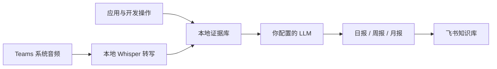

<div align="center">

# Worklog

### 每个 App 都有日志。现在，你的一天也有了。

Worklog 把散落在 Agent、终端、应用和会议里的工作重新汇合，过滤掉与工作无关的噪声，自动生成日报、周报和月报，并按「月 → 周 → 日」归档到飞书知识库。


[快速开始](#快速开始) · [工作原理](#工作原理) · [Teams-会议](#teams-会议) · [隐私](#数据与隐私) · [排障](#常见问题)

</div>

> Worklog 目前只支持 macOS。图形化 `.dmg` 安装包正在规划中，当前版本仍需从源码初始化。

## 为什么是 Worklog

每个 App 都有自己的 log，但你工作了一整天，却没有一份属于自己的工作档案。

过去，我们会在下班前努力回忆：今天做了什么、解决了什么、会议里决定了什么，然后手写一份日报。也许那曾经够用。但现在是 2026 年——你可能同时开着三个 Claude Code、一个 OpenCode 和两个 Codex，在无数上下文、Agent 与 Sub-agent 之间穿梭。任务被并行执行，结论散落在不同会话里，很多真正完成的工作甚至没有经过你的键盘。

问题已经不是「懒得写日报」，而是人很难完整重建这张分布式的工作现场。

Worklog 为此而生。它从电脑上已经存在的操作和 Agent 执行记录中还原工作过程，把应用活动、终端命令、代码任务与 Teams 会议放回同一天的上下文，再由你选择的 LLM 过滤、归纳和总结。最终留下的不是工具调用流水账，而是一份关于项目进展、实际产出、关键判断和当前状态的个人工作档案。

当然，那些与工作无关的事情会被过滤掉。

当前版本会深度解析 Claude Code 与 Codex 的执行日志；其他 Agent 工具暂时通过前台应用和终端活动提供线索，后续将逐步增加原生日志解析器。

## 功能一览

| 能力 | Worklog 的处理方式 |
| --- | --- |
| 工作操作 | 工作日 08:00–18:00 采集前台应用、窗口标题与可确认的终端/开发工具活动 |
| Teams 会议 | 根据 Teams 的真实音频活动自动开始和结束，录制系统播放声音，不使用麦克风 |
| 本地转写 | 使用 whisper.cpp 在 Mac 本机把会议音频转成文字 |
| 智能整理 | 调用可配置的 OpenAI 或 Anthropic 兼容接口，围绕项目、成果与判断生成内容 |
| 飞书发布 | 通过飞书 CLI 以当前用户身份写入知识库，不保存机器人密钥 |
| 自动归档 | 自动维护「月份 → 周 → 日报」层级，并在同一知识体系中生成周报和月报 |
| 可视化管理 | 在本地页面配置 LLM、飞书位置和会议能力，查看最近生成与失败记录 |
| 后台运行 | 登录后自动启动，异常退出后由 macOS LaunchAgent 恢复 |

## 工作原理



默认节奏：

- 工作日 18:00：覆盖生成当天 08:00–18:00 的日报；
- 周一 08:00：汇总上一个自然周的工作日，生成周报；
- 每月 1 日 08:10：汇总上一个自然月，生成月报。

生成内容强调完成了什么、为什么这样处理、当前结果如何。采集器自身的运行、飞书同步过程、无业务意义的硬件事件和重复噪声不会被包装成工作成果。

## 快速开始

### 1. 准备环境

- macOS 13 或更高版本
- Node.js 20+
- [飞书 CLI](https://open.feishu.cn/document/no_class/mcp-archive/feishu-cli-installation-guide.md)
- FFmpeg
- whisper.cpp 与 GGML Whisper 模型（启用 Teams 会议时需要）

### 2. 启动 Worklog

```bash
npm install
npm run build-native
npm start
```

打开 [http://127.0.0.1:4318](http://127.0.0.1:4318)。管理页面只监听本机地址，不会暴露给局域网或互联网。

### 3. 完成首次初始化

```bash
npm install -g @larksuite/cli
npx -y skills add https://open.feishu.cn --skill -y
lark-cli config init --new
lark-cli auth login --recommend
lark-cli auth status --json --verify
```

随后在 Worklog 页面完成四件事：

1. 确认飞书 CLI 已连接到正确的用户；
2. 填写 LLM 协议、API 地址、模型和 API Key；
3. 粘贴目标飞书知识库父页面链接并绑定；
4. 点击「立即生成今天日报」完成第一次验证。

运行自检可以一次确认主要依赖：

```bash
npm run doctor
```

## Teams 会议

Worklog 直接采集 Mac 正在播放的系统声音。即使你全程静音，其他参会人的发言仍可被记录；麦克风不会被读取。

首次启用时安装本地转写依赖：

```bash
brew install ffmpeg whisper-cpp
mkdir -p data/models
curl -L -o data/models/ggml-small.bin https://huggingface.co/ggerganov/whisper.cpp/resolve/main/ggml-small.bin
```

macOS 会在第一次录制时请求「屏幕与系统音频录制」权限。Worklog 通过 CoreAudio 判断 Teams 是否存在真实音频 I/O，窗口标题只用于入会阶段的辅助判断和会议命名，不依赖固定标题关键词。页面中也保留了手动开始、停止和失败重试入口。

会议结束后，转写文本先经过静音、重复词和识别噪声过滤，再与当天其他工作证据一起交给 LLM。有效讨论、结论和待办会进入当日日报，不会另外创建会议文档。

## 保持后台运行

```bash
npm run install-service
```

安装完成后，Worklog 会随当前 macOS 用户登录启动，并在意外退出后自动恢复。内部 LaunchAgent 标识仍为 `com.local.mac-worklog-feishu`，这是为了兼容已经安装的版本，不影响产品显示名称。

## 数据与隐私

Worklog 采用本地优先设计：

- 不记录键盘输入、剪贴板、截图或浏览器正文；
- 原始活动、会议音频、逐字稿、报告副本和飞书索引都保存在本机 `data/`；
- LLM API Key 保存在 macOS Keychain；
- 原始会议音频不会发送给 LLM，也不会上传飞书；
- 只有生成报告所需的操作证据与有效逐字稿会发给你配置的 LLM 服务；
- `data/`、本机设置和密钥均被 Git 忽略。

你仍应根据所用 LLM 服务商的数据政策，决定是否启用远程生成以及是否需要额外脱敏。

## 项目结构

```text
src/
  sampler.ts        macOS 前台应用采样
  agentLogs.ts      开发工具执行记录解析
  collector.ts      工作时间窗过滤与证据聚合
  teamsMeeting.ts   Teams 检测、录制、转写与恢复
  llm.ts            日报、周报和月报生成
  reportRunner.ts   报告生成与发布流程
  larkCli.ts        飞书 CLI 认证与调用
  feishu.ts         知识库层级和文档发布
  render.ts         飞书富文档渲染
  scheduler.ts      定时任务
  routes.ts         本地管理接口
native/             macOS 音频活动检测与系统音频采集
public/             本地配置和运行历史页面
scripts/            自检与 LaunchAgent 安装
test/               单元测试
```

## 常见问题

<details>
<summary>飞书 CLI 显示需要刷新</summary>

运行：

```bash
lark-cli auth status --json --verify
```

仍然失效时，重新执行 `lark-cli auth login --recommend`。

</details>

<details>
<summary>关闭终端后服务停止</summary>

安装后台服务：

```bash
npm run install-service
launchctl print gui/$(id -u)/com.local.mac-worklog-feishu
```

</details>

<details>
<summary>为什么报告没有记录晚上或周末的操作</summary>

默认只纳入工作日 08:00–18:00。可以在本地管理页面修改日报计划和时区；工作时间窗目前按产品默认规则执行。

</details>

## 开发

```bash
npm run dev
npm run check
npm test
node --check public/app.js
```

## Roadmap

- [ ] 提供签名、公证的 macOS `.dmg` 安装包
- [ ] 把首次授权、依赖检查和模型下载整合进安装向导
- [ ] 增加睡眠或关机错过定时任务后的自动补跑
- [ ] 增加可选的本地敏感信息脱敏规则

## 致谢

- Teams 会议自动检测思路参考 [qaid/meeting-minutes-autodetect](https://github.com/qaid/meeting-minutes-autodetect)
- 本地语音转写由 [whisper.cpp](https://github.com/ggerganov/whisper.cpp) 提供
- 飞书文档与知识库操作使用官方 [飞书 CLI](https://open.feishu.cn/document/no_class/mcp-archive/feishu-cli-installation-guide.md)

第三方许可见 [THIRD_PARTY_NOTICES.md](THIRD_PARTY_NOTICES.md)。
