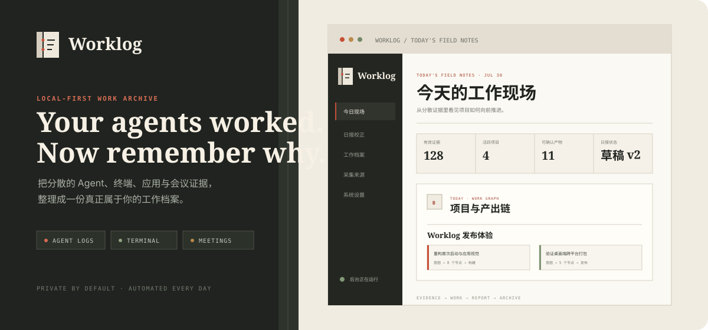
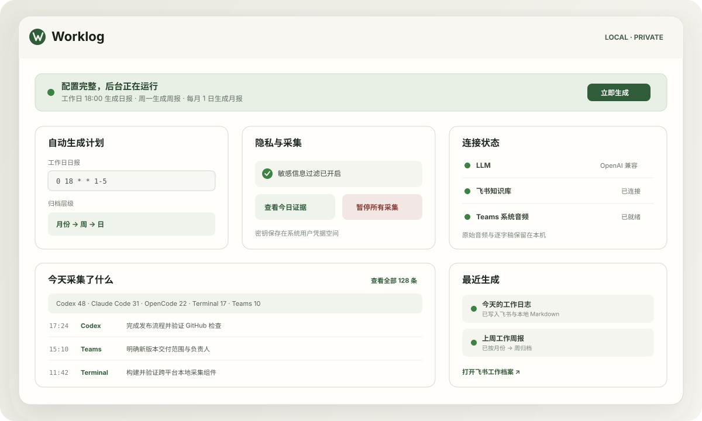
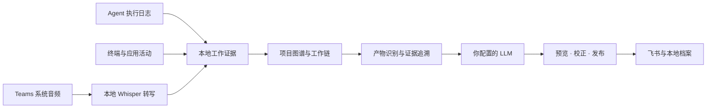

<div align="center">



## 每个 App 都有 log。你的一天也应该有。

Worklog 在你的电脑上汇合 Agent、终端、应用与会议留下的工作证据，<br />
过滤无关噪声，生成日报、周报和月报，自动归档到飞书或本地 Markdown。

<p>
  
  
  
  
  
  
  
  
  
</p>

[为什么需要它](#为什么需要它) · [产品预览](#产品预览) · [核心能力](#核心能力) · [平台能力](#平台能力) · [快速开始](#快速开始) · [Roadmap](#roadmap)

</div>

> [!NOTE]
> Worklog v0.3 是 macOS、Windows 与 Linux 的跨平台公开预览版。三端共享 Agent 采集、前台应用、自动报告、飞书归档与本地 Markdown；Teams 系统音频目前仅在 macOS 可用。

## 为什么需要它

每个 App 都有自己的 log，但你工作了一整天，却没有一份属于自己的工作档案。

过去，我们会在下班前努力回忆：今天做了什么、解决了什么、会议里决定了什么，然后手写一份日报。也许那曾经够用。

但现在是 2026 年。

你可能同时开着三个 Claude Code、一个 OpenCode 和两个 Codex，在无数上下文、Agent 与 Sub-agent 之间穿梭。任务被并行执行，结论散落在不同会话里，很多真正完成的工作甚至没有经过你的键盘。

**问题已经不是「懒得写日报」，而是人很难完整重建这张分布式的工作现场。**

Worklog 为此而生。它从电脑上已经存在的操作与 Agent 执行记录中还原工作过程，把应用活动、终端命令、代码任务和 Teams 会议放回同一天的上下文，再由你选择的 LLM 过滤、理解和总结。

最后留下的不是工具调用流水账，而是一份关于**项目进展、实际产出、关键判断和当前状态**的个人工作档案。

那些与工作无关的事情，不应该进入你的工作档案。

## 从工作证据，到长期档案

<table>
<tr>
<td width="33%" valign="top">

### 01 / 自动采集

持续观察有效工作操作，读取受支持的 Agent 执行日志；macOS 还可在 Teams 通话时采集系统声音。无需在每个任务结束后手动登记。

</td>
<td width="33%" valign="top">

### 02 / 理解工作

将分散的证据按项目与上下文重组。过滤设备事件、重复操作、静音、识别噪声和与工作无关的内容。

</td>
<td width="33%" valign="top">

### 03 / 自动归档

生成自然、可复盘的日报，并进一步汇总为周报与月报，按「月份 → 周 → 日」写入飞书知识库。

</td>
</tr>
</table>

## 产品预览



<p align="center"><sub>工作证据 → 项目与产出 → 日报校正 → 长期归档。预览内容已脱敏。</sub></p>

## 它记录什么

| 记录 | 不记录 |
| --- | --- |
| Claude Code、Codex 与 OpenCode 的任务、工具调用和文件操作 | 键盘输入与密码 |
| 可确认的终端命令和前台应用上下文 | 剪贴板内容 |
| macOS 上 Teams 中电脑实际播放的会议声音 | 麦克风音频 |
| 会议讨论、结论与待办 | 截图与屏幕画面 |
| 生成报告所需的结构化工作证据 | 浏览器页面正文 |
| 日报、周报和月报的本地副本 | 与工作无关的系统事件 |

当前版本原生解析 Claude Code、Codex 与 OpenCode 的执行日志；其他 Agent 工具仍可通过前台应用与终端活动提供基础线索。

## 它如何工作



<details>
<summary><strong>默认自动运行时间</strong></summary>

- 工作日 08:30：从最近档案生成晨间续接；
- 工作日 18:00：覆盖生成当天 08:00–18:00 的日报；
- 周一 08:00：汇总上一个自然周，生成周报；
- 每月 1 日 08:10：汇总上一个自然月，生成月报。

</details>

## 核心能力

- **不是流水账**：围绕项目、产出、判断和状态组织内容，不罗列应用切换。
- **会议属于工作本身**：会议结论直接进入当日日报，不另外制造孤立的会议文档。
- **只录系统声音**：即使你全程静音，也能记录其他参会人的发言；不会读取麦克风。
- **本地完成转写**：通过 whisper.cpp 转写 Teams 音频，原始音频不离开电脑。
- **使用自己的模型**：支持 OpenAI 与 Anthropic 兼容接口，模型和服务商由你决定。
- **使用自己的飞书身份**：通过官方飞书 CLI 写入知识库，不保存机器人 App Secret。
- **看得见的自动化**：本地管理页面展示配置、会议状态、最近生成结果与失败重试。
- **菜单栏常驻**：直接查看状态、暂停或恢复采集、立即生成日报，并打开当天飞书文档。
- **登录后自动启动**：使用系统原生登录项或 XDG 自动启动，只监听 `127.0.0.1`。
- **跨平台桌面端**：Windows 使用系统托盘与登录启动，Linux 提供系统托盘和 XDG 自动启动。

### 工作档案智能层

1. 自动识别项目边界，将不同 Agent、终端和应用证据合并到同一项目；
2. 连接「意图 → 执行 → 产物 → 结果」，呈现工作是如何真正完成的；
3. 把提交、PR、发布、文档、文件、构建、测试、部署和决策作为一等产物；
4. 为报告段落计算可信度，可展开查看对应的本地原始证据；
5. 发布前提供完整预览、直接编辑、项目重归类和初稿/当前版本对比；
6. 从用户接受的修改中学习项目别名、排除主题与报告篇幅，偏好只保存在本机；
7. 检测缺少结果或项目归属的证据，最多提出两个聚焦问题；
8. 每个工作日早晨恢复最近的活跃项目和未决上下文；
9. 搜索长期工作档案，并用带编号来源的回答支持复盘；
10. Windows/Linux Release 流程自动执行安装、启动、健康检查、凭据回环与卸载验收。

## 平台能力

| 能力 | macOS | Windows | Linux |
| --- | :---: | :---: | :---: |
| Claude Code、Codex、OpenCode 日志 | ✓ | ✓ | ✓ |
| 前台应用与窗口上下文 | ✓ | ✓ | ✓¹ |
| 日报、周报、月报与本地 Markdown | ✓ | ✓ | ✓ |
| 飞书 CLI 用户授权与知识库归档 | ✓ | ✓ | ✓ |
| 菜单栏 / 系统托盘与登录启动 | ✓ | ✓ | ✓ |
| Teams 系统音频与本地转写 | ✓ | 规划中 | 规划中 |

<sub>¹ Linux X11 使用 `xdotool`；KDE Wayland 使用 `kdotool`。其他 Wayland 桌面的 Agent 日志与报告功能仍可使用，但前台窗口采集可能受桌面安全策略限制。</sub>

> [!WARNING]
> “支持”和“已经完成实机端到端验收”不是一回事。v0.3 的三系统核心测试和原生安装包构建均已通过；Windows/Linux 的交互安装、托盘、自动启动、凭据持久化、前台窗口采集和飞书实际发布仍需实机验收。完整状态见 [兼容性与验证矩阵](docs/COMPATIBILITY.md)。在这些检查完成前，Windows/Linux 版本应标记为 **Preview**。

## 快速开始

### 环境要求

- macOS 13+、Windows 10+，或主流 64 位 Linux 桌面发行版；
- 一个可用的飞书自建应用与知识库页面；
- 一个 OpenAI 或 Anthropic 兼容的 LLM API。

### 1 · 安装 Worklog

从 [Releases](https://github.com/dedarek/ai-human-daily-worklog/releases) 下载对应系统的安装包：

| 系统 | 文件 | 安装方式 |
| --- | --- | --- |
| macOS | `Worklog-*-universal-unsigned.dmg` | 打开后拖入 Applications；同时支持 Apple Silicon 与 Intel |
| Windows | `Worklog-*-Windows-x64.exe` | 运行安装向导，可选择目录并创建开始菜单/桌面入口 |
| Linux | `Worklog-*-Linux-x86_64.AppImage` | 添加执行权限后直接运行 |
| Debian / Ubuntu | `Worklog-*-Linux-amd64.deb` | 使用系统软件安装器或 `apt` 安装 |

当前公开预览包未购买商业代码签名证书。macOS 第一次启动时请在 Applications 中右键 Worklog，选择「打开」；Windows SmartScreen 如出现提示，请确认下载来源为本仓库 Release 后选择「更多信息 → 仍要运行」。Linux AppImage 可执行：

```bash
chmod +x Worklog-*-Linux-x86_64.AppImage
./Worklog-*-Linux-x86_64.AppImage
```

首次打开后，向导会依次完成：

1. 当前系统需要的前台应用权限（macOS 另含屏幕与系统音频权限）；
2. 飞书应用配置和用户授权；
3. LLM 与目标知识库；macOS 额外下载 Whisper Small 模型；
4. 完整性检查与开始运行。

之后 Worklog 常驻菜单栏。退出、暂停记录、手动生成和打开当天文档都不需要终端。

### 从源码运行

源码开发需要 Node.js 20+ 和 [飞书 CLI](https://open.feishu.cn/document/no_class/mcp-archive/feishu-cli-installation-guide.md)。macOS 会议能力还需要 Xcode Command Line Tools。

```bash
git clone https://github.com/dedarek/ai-human-daily-worklog.git
cd ai-human-daily-worklog
npm install
npm start
```

macOS 如需 Teams 系统音频，再运行 `npm run build-native`。Linux 前台窗口采集请安装 `xdotool`（X11）或 `kdotool`（KDE Wayland）。

访问 [http://127.0.0.1:4318](http://127.0.0.1:4318)。

### 源码模式下登录飞书 CLI

```bash
npm install -g @larksuite/cli
npx -y skills add https://open.feishu.cn --skill -y
lark-cli config init --new
lark-cli auth login --recommend
lark-cli auth status --json --verify
```

### 源码模式下完成初始化

在 Worklog 页面：

1. 确认飞书 CLI 已连接到正确用户；
2. 填写 LLM 协议、API 地址、模型和 API Key；
3. 粘贴目标飞书知识库父页面链接；
4. 在「今天采集了什么」中确认过滤后的素材；
5. 在「日报预览与校正」中生成预览，查看证据可信度，再发布到飞书。

```bash
# 一次检查主要依赖与授权状态
npm run doctor

# 安装登录自启服务
npm run install-service
```

## Teams 会议

macOS 版本通过 CoreAudio 判断 Teams 是否存在真实音频活动，并使用 ScreenCaptureKit 采集电脑正在播放的声音。窗口标题只辅助识别入会和会议名称，不依赖固定关键词。Windows 与 Linux 预览版暂不采集会议音频，也不会生成空会议记录；Agent、应用和报告能力不受影响。

`.dmg` 已内置 Universal whisper.cpp，首次向导会下载并校验 Whisper Small 模型。仅从源码运行时需要手动准备依赖：

```bash
brew install whisper-cpp
mkdir -p "$HOME/Library/Application Support/Worklog/models"
curl -L -o "$HOME/Library/Application Support/Worklog/models/ggml-small.bin" \
  https://huggingface.co/ggerganov/whisper.cpp/resolve/main/ggml-small.bin
```

首次录制时，macOS 会请求「屏幕与系统音频录制」权限。会议结束后，逐字稿会经过质量过滤，再与当天其他工作证据共同生成日报。转写或总结失败时，可以从管理页面重试；已有逐字稿会直接复用。

## 隐私边界

Worklog 是一个 **local-first** 项目，而不是一个云端监控服务。

- 原始活动、报告副本和飞书索引保存在系统标准用户数据目录；macOS 的会议音频和逐字稿也保存在其中；
- LLM API Key 在 macOS 使用 Keychain，在 Windows 使用当前用户 DPAPI，在 Linux 优先使用 Secret Service；
- 原始会议音频不会发送给 LLM，也不会上传飞书；
- 只有经过过滤与脱敏的工作证据、会议文本会发送给你配置的 LLM；
- 本机数据、配置与密钥均被 Git 忽略。

> [!IMPORTANT]
> 「本地优先」不代表报告生成完全离线。启用远程 LLM 后，生成所需的文本证据会发往你配置的服务商。请根据其数据政策决定是否启用或增加脱敏规则。

## 项目结构

```text
src/
├── sampler.ts        # macOS / Windows / Linux 前台应用采样
├── agentLogs.ts      # Agent 执行日志解析
├── collector.ts      # 工作证据过滤与聚合
├── teamsMeeting.ts   # Teams 检测、录制、转写与恢复
├── llm.ts            # 日报、周报和月报生成
├── reportRunner.ts   # 报告生成与发布流程
├── larkCli.ts        # 飞书 CLI 认证与调用
├── feishu.ts         # 知识库层级和文档发布
├── render.ts         # 飞书富文档渲染
└── scheduler.ts      # 自动运行计划
native/               # macOS 音频检测与系统音频采集
macos/                # 菜单栏应用、权限声明与签名配置
desktop/              # Windows / Linux Electron 托盘应用与图标
public/               # 本地管理页面
scripts/              # 自检、Universal App、DMG 与公证脚本
test/                 # 单元测试
```

## 常见问题

<details>
<summary><strong>飞书 CLI 登录状态失效</strong></summary>

```bash
lark-cli auth status --json --verify
lark-cli auth login --recommend
```

</details>

<details>
<summary><strong>关闭终端后服务停止</strong></summary>

```bash
npm run install-service
launchctl print gui/$(id -u)/com.local.mac-worklog-feishu
```

内部服务标识保留旧名称，用于兼容已经安装的版本，不影响产品显示名称。

</details>

<details>
<summary><strong>报告为什么没有记录晚上或周末的操作</strong></summary>

默认工作证据窗口为工作日 08:00–18:00。这个边界用于避免把私人使用和下班后的系统活动混入工作档案。

</details>

## Roadmap

Worklog 的目标不只是生成一份日报，而是成为 AI 时代个人可拥有、可迁移、可长期检索的工作档案。下面是当前规划方向；顺序代表大致优先级，不代表固定发布日期。

它的核心不是记录“人在电脑前忙了多久”，而是恢复分散在人、Agent、会议和产物之间的工作上下文。更完整的原则、产品闭环和明确不做的事情见 [产品愿景](docs/VISION.md)。

### 下一批优先级

1. **把预览能力产品化**：句子级重写、可视化差异和桌面通知，让每日校正更短。
2. **扩展真实产物连接**：读取 GitHub PR、Issue、CI 和发布结果，减少仅靠文本推断。
3. **完成交互式实机验收**：覆盖 Windows 10/11、GNOME 与 KDE，并验证真实飞书发布。
4. **补齐隐私生命周期**：原始证据保留期限、按项目删除、加密和离线模型。
5. **开放插件协议**：让新 Agent、会议平台和归档目的地无需修改核心即可接入。

<details open>
<summary><strong>近期 · 做成可靠的跨平台桌面产品</strong></summary>


- [x] 建立同时支持 Apple Silicon 与 Intel 的 `.app` / `.dmg` 构建、签名与 Apple 公证发布链路
- [x] 发布可拖入 Applications 安装的 Universal unsigned preview DMG
- [ ] 发布首个经过 Developer ID 签名和 Apple 公证的公开 `.dmg`
- [x] 提供菜单栏应用：查看采集状态、暂停记录、手动生成和快速打开当天文档
- [x] 将飞书授权、LLM 配置、系统权限、Whisper 模型下载整合进首次启动向导
- [x] 将运行数据迁移到标准的 `Application Support/Worklog`，不再依赖源码目录
- [ ] 支持应用内自动更新、版本说明和安全回滚
- [x] 在电脑睡眠、关机或离线错过任务后自动补跑，并保证同一报告不会重复创建
- [ ] 提供更清楚的健康检查、失败通知、重试队列与可导出的诊断报告
- [ ] 完成 Windows 10/11 的安装、托盘、登录启动、DPAPI、飞书发布与卸载实机验收
- [ ] 完成 Linux AppImage/deb、GNOME/KDE、Secret Service、飞书发布与卸载实机验收
- [x] 在 Windows/Linux 原生 CI 中执行安装包启动、健康检查、凭据回环与卸载验收

</details>

<details>
<summary><strong>更多 Agent 与工作数据源</strong></summary>


- [x] Claude Code 原生执行日志
- [x] Codex 原生执行日志
- [x] 终端命令、前台应用和窗口上下文
- [x] Microsoft Teams 系统音频与本地会议转写
- [x] OpenCode 原生执行日志
- [ ] Cursor、Windsurf、Cline、Continue 等 IDE Agent
- [ ] VS Code、JetBrains 与 Xcode 的项目、文件和调试活动
- [ ] Git 提交、分支、Pull Request、Issue 与 CI 结果
- [ ] 日历日程、任务系统和工单上下文，用于解释「为什么做这件事」
- [ ] Zoom、Google Meet 与飞书会议，并支持说话人区分和待办归属
- [ ] 插件化采集器 SDK，让社区为新 Agent 和工具添加解析器

</details>

<details>
<summary><strong>不止飞书：更多归档目的地</strong></summary>


- [x] 飞书知识库，按「月份 → 周 → 日」自动归档
- [x] 本地 Markdown 文件夹，适配 Obsidian、Logseq 和普通 Git 仓库
- [ ] Notion 页面与数据库
- [ ] Google Docs / Google Drive
- [ ] Microsoft 365：OneNote、SharePoint 与 Word
- [ ] 纯本地 HTML / PDF 周报与月报
- [ ] Webhook 与开放 API，接入企业内部知识库或自建系统
- [ ] 同时发布到多个目的地，并分别配置模板、语言和可见内容

</details>

<details>
<summary><strong>更懂工作的报告</strong></summary>


- [x] 自动识别项目边界，把同一项目在多个 Agent 和应用中的活动合并
- [x] 连接用户意图、Agent 执行、代码/文档产物与最终验证，形成可查询的工作链路
- [x] 将 Git commit、PR、Release、文档、文件、构建、测试、部署和决策识别为一等工作产物
- [ ] 跨会话、跨 Agent 去重，避免把同一修改重复计算为多项成果
- [ ] 区分探索过程、最终决策、已完成产出、阻塞问题与风险
- [ ] 从会议结论追踪后续执行，检查待办是否在之后的工作记录中落地
- [ ] 支持日报、周报、月报、项目周报、绩效回顾等自定义模板
- [x] 为每条重要结论保留可回溯的本地证据，但默认不在正式报告中堆砌证据编号
- [ ] 建立长期项目记忆，让周报和月报理解连续进展，而不是简单拼接日报
- [ ] 支持中文、英文及双语报告，并允许配置个人写作语气
- [x] 在发送前提供预览、全文改写、人工确认和初稿/当前版本对比
- [x] 报告句子可回溯到本地证据与置信度，低置信结论在发布前提示
- [x] 从用户的项目重分配、删除和改写中学习本地偏好，不上传个人行为画像
- [x] 下班前对证据缺口提出至多 1–2 个聚焦问题，避免错误永久归档
- [x] 生成晨间续接摘要，恢复活跃项目、未决事项和最近上下文
- [x] 对个人历史档案进行带证据的搜索与问答，支持项目复盘

</details>

<details>
<summary><strong>隐私、控制与本地 AI</strong></summary>


- [x] 可配置的敏感信息识别与脱敏：密钥、客户名、仓库名、路径和自定义词表
- [ ] 应用、项目、时间段与会议级别的允许/排除规则
- [ ] 原始记录自动清理策略，以及「只保留摘要、不保留原文」模式
- [ ] 本地数据库加密和可选的报告端到端加密备份
- [ ] 支持 Ollama、MLX、llama.cpp 等完全本地的 LLM
- [ ] 在本地完成嵌入与检索，远程模型只接收最少必要上下文
- [x] 提供「今天记录了什么」审计视图和暂停/恢复能力
- [ ] 增加历史记录一键删除、按日期清理和导出前确认

</details>

<details>
<summary><strong>跨平台与开放生态</strong></summary>


- [x] Linux 桌面版：AppImage / deb、系统托盘、自动启动、Agent 日志与前台应用
- [x] Windows 桌面版：安装向导、系统托盘、登录启动、Agent 日志与前台应用
- [ ] Windows Teams 系统音频的原生采集方案
- [ ] GNOME Wayland 前台窗口采集扩展与 Flatpak 包
- [ ] 定义稳定的工作证据、会议和报告数据格式
- [ ] 支持配置、模板和历史索引的导入导出
- [ ] 提供采集器、过滤器、报告模板和发布器插件接口
- [x] 增加贡献指南、隐私模型、安全策略与标准 Issue / PR 模板
- [x] 建立兼容性与验证矩阵，明确“支持、已构建、已实机验收”的差异
- [ ] 公开版本计划与稳定发布节奏

</details>

如果你希望 Worklog 优先支持某个 Agent、会议平台或归档目的地，欢迎通过 [Issue](https://github.com/dedarek/ai-human-daily-worklog/issues) 描述你的工作流，而不只是提交一个工具名称。

## 开发

```bash
npm run dev
npm run check
npm test
npm run smoke
node --check public/app.js

# 构建 Universal Worklog.app 与本地测试 DMG
npm run build-app
npm run build-dmg

# 构建 Windows 安装器或 Linux AppImage / deb
npm run build-windows
npm run build-linux
```

正式发布由 `.github/workflows/release.yml` 完成。仓库需要配置以下 Actions Secrets：

| Secret | 内容 |
| --- | --- |
| `MACOS_CERTIFICATE_BASE64` | Developer ID Application `.p12` 的 Base64 内容 |
| `MACOS_CERTIFICATE_PASSWORD` | 导出 `.p12` 时设置的密码 |
| `MACOS_KEYCHAIN_PASSWORD` | CI 临时 Keychain 密码 |
| `MACOS_SIGN_IDENTITY` | `Developer ID Application: … (TEAMID)` 完整名称 |
| `APPLE_ID` | Apple Developer 账户 |
| `APPLE_TEAM_ID` | Apple Developer Team ID |
| `APPLE_APP_PASSWORD` | Apple ID App 专用密码 |

工作流会构建双架构 App、启用 Hardened Runtime、签名所有嵌套可执行文件、提交 Apple 公证、装订公证票据，并把 DMG 上传到 GitHub Release。

## 致谢

Teams 会议自动检测思路参考 [qaid/meeting-minutes-autodetect](https://github.com/qaid/meeting-minutes-autodetect)，本地语音转写由 [whisper.cpp](https://github.com/ggerganov/whisper.cpp) 提供，飞书文档与知识库操作使用官方 [飞书 CLI](https://open.feishu.cn/document/no_class/mcp-archive/feishu-cli-installation-guide.md)。

第三方许可见 [THIRD_PARTY_NOTICES.md](THIRD_PARTY_NOTICES.md)。

## 参与与许可

Worklog 采用 [Apache License 2.0](LICENSE) 开源。开始贡献前请阅读 [贡献指南](CONTRIBUTING.md)、[安全策略](SECURITY.md) 和 [隐私模型](PRIVACY.md)。

<div align="center">

**Your tools remember everything. Worklog remembers what mattered.**

</div>
